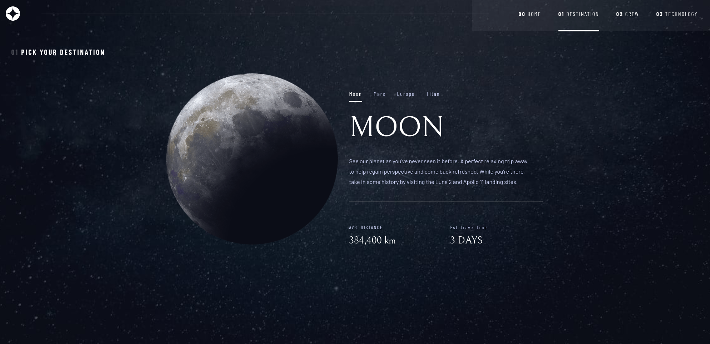
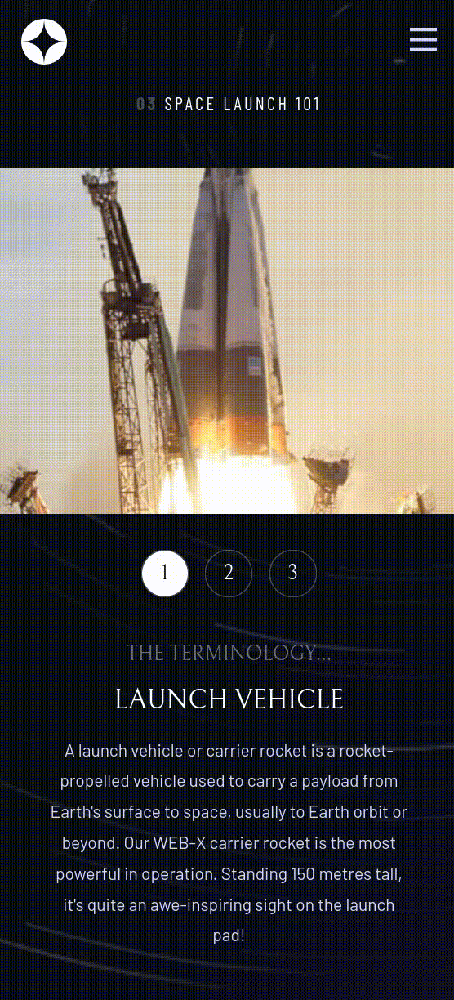

# Space Tourism Multi-Page Website

A modern, fully responsive multi-page website exploring space travel destinations, crew members, and cutting-edge technology. Built with Alpine.js and Tailwind CSS v4.



## Overview

### The Challenge

Build a fully responsive multi-page website with:

- Four distinct pages (Home, Destination, Crew, Technology)
- Dynamic content loading from JSON
- Tab-based navigation without page reloads
- Mobile-first responsive design across three breakpoints
- Smooth transitions and micro-animations

### Solution Highlights

- **Dynamic content management** using Alpine.js stores and JSON API
- **Multi-page navigation** with active state tracking across pages
- **Custom keyframe animations** for enhanced user interactions
- **Responsive image strategy** (landscape/portrait variants, background images)
- **UX micro-interactions** with subtle shadow pulses and custom selection styles
- **Tailwind v4 features** including `@utility` directive and CSS variable integration

## Built With

### Core Technologies

- **Alpine.js** - Lightweight reactive framework for state management
- **Tailwind CSS v4** - Utility-first CSS with modern features
- **esbuild** - Fast JavaScript bundler
- **JSON** - Dynamic content source

### Development Tools

- **npm-run-all** - Parallel script execution
- **VSCode** - Configured with Tailwind IntelliSense
- **Git** - Version control

## Key Features

### Multi-Page Architecture

Four interconnected pages with shared navigation:

- **Home:** Hero section with exploration CTA
- **Destination:** Tab-based planet explorer (Moon, Mars, Europa, Titan)
- **Crew:** Dot navigation for crew member profiles
- **Technology:** Numbered navigation for space tech showcase

### Dynamic Content System

- Centralized JSON data source for all pages
- Alpine.js store pattern for global state management
- Client-side routing with active state indicators
- Smooth transitions between content without page reloads

### Responsive Strategy

Mobile-first implementation with adaptive layouts:

- **Mobile (base):** Vertical stacking, hamburger menu, landscape images
- **Tablet (768px+):** Adjusted spacing, enhanced typography
- **Desktop (1024px+):** Multi-column layouts, portrait images, full navigation

### Interactive Elements

- Hamburger menu with backdrop blur (mobile)
- Tab navigation with custom active states
- Dot indicators with hover effects
- Numbered buttons with ring pulse animations
- Custom text selection styling

## Technical Implementation

### Alpine.js DOM Synchronization

Navigation state tracking required understanding Alpine's async DOM updates:

```javascript
x-init="$nextTick(() => {
  $store.navigation.currentPage = window.location.pathname.split('/').pop();
})"
```

**Why:** Alpine updates DOM asynchronously. `$nextTick` ensures code executes after DOM is ready, fixing active state timing issues.

---

### Full-Width Images in Constrained Containers

Technology page needed full-bleed images while maintaining content padding:

```html
<div class="relative h-[33vh]">
  <div
    class="absolute left-1/2 w-screen -translate-x-1/2 bg-cover bg-center"
    :style="`background-image: url('${image}')`"
  ></div>
</div>
```

**Solution:** Relative wrapper holds height, absolute child with `w-screen` breaks container bounds, centered with `translate-x-1/2`.

---

### Custom Keyframe Animations

Created subtle ring pulse effect for numbered navigation:

```css
--animate-ring: ring-pulse 2s ease-out infinite;

@keyframes ring-pulse {
  0%,
  100% {
    box-shadow: 0 0 0 0px rgba(255, 255, 255, 0.5);
  }
  50% {
    box-shadow: 0 0 0 88px rgba(255, 255, 255, 0);
  }
}
```

**UX Insight:** Large shadows (88px) work on single elements without GPU performance hits. Micro-animations (2-3px) are subconsciously pleasant without being noticeable.

---

### Tailwind v4 Typography System

Utilized v4's `@utility` directive for responsive typography presets:

```css
@utility text-preset-1 {
  font-family: "Bellefair", serif;
  @apply text-[144px];
}

@utility text-mobile-preset-1 {
  font-family: "Bellefair", serif;
  @apply text-[80px];
}
```

**Usage:**

```html
<h1 class="text-mobile-preset-1 md:text-tablet-preset-2 lg:text-preset-1">SPACE</h1>
```

**Advantage:** `@utility` classes work with Tailwind's responsive prefixes, unlike plain CSS classes.

---

### Alpine Store Pattern for Shared Data

Centralized data management across all pages:

```javascript
// main.js
Alpine.store("data", {
  destinations: [],
  crew: [],
  technology: [],

  async init() {
    const response = await fetch("/data.json");
    const json = await response.json();
    Object.assign(this, json);
  },
});
```

```html
<!-- Any page can access shared data -->
<template x-for="destination in $store.data.destinations">
  <div x-text="destination.name"></div>
</template>
```

---

### Custom Selection Styling

Enhanced text selection for branded experience:

```css
@layer utilities {
  .text-blue-300::selection {
    background-color: #0b0d17;
    color: white;
  }
}
```

**Detail:** Users rarely notice custom selection colors, but it reinforces brand cohesion when they copy text.

## Development Process

### What I Learned

**1. Multi-Page State Management**

Managing navigation state across separate HTML files required Alpine stores and `$nextTick` understanding. Browser caching helps with repeated JSON fetches.

**2. Responsive Image Strategies**

Different approaches for different contexts:

- Background images for full-bleed layouts (Technology page)
- `` tags with separate mobile/desktop sources (Crew page)
- Tailwind's responsive background utilities for page backgrounds

**3. Tailwind v4 Migration**

Learned v4 syntax through this project:

- `@utility` instead of `@layer components`
- CSS variables with `--var-name` convention
- `@variant` for custom state combinations

**4. Performance-Conscious Animations**

Understood GPU rendering costs:

- Heavy shadows/blurs on single elements = fine
- Same effects on many elements = performance hit
- Subtle animations (2-3px) provide UX value without visual noise

### Challenges & Solutions

**Challenge:** Navigation active states not updating on page load

**Solution:** Used Alpine's `$nextTick` to ensure DOM was ready before setting current page state. Alpine's reactive updates are asynchronous.

---

**Challenge:** Full-width background images breaking out of padded containers

**Solution:** Nested structure with relative parent (sets height) and absolute child with `w-screen` (ignores container). Centered with `left-1/2 -translate-x-1/2`.

---

**Challenge:** Managing typography across 3+ breakpoints with consistent naming

**Solution:** Created systematic preset classes (mobile/tablet/desktop) using Tailwind v4's `@utility` directive, enabling responsive modifier usage.

## Project Structure

```
space-tourism/
│
├── index.html              # Home page
├── destination.html        # Destinations with tab navigation
├── crew.html              # Crew members with dot navigation
├── technology.html          # Technology with numbered navigation
│
├── data/
│   └── data.json                  # Centralized content source
├── src/
│   ├── js/
│   │   └── main.js        # Alpine.js initialization & stores
│   └── styles/
│       ├── input.css      # Tailwind source with custom utilities
│       └── tailwind.css   # Compiled output
├── dist/
│   └── bundle.js          # Bundled JavaScript
├── assets/
│   ├── destination/       # Planet images
│   ├── crew/              # Crew member images
│   ├── technology/        # Technology images (portrait/landscape)
│   └── shared/            # Navigation icons, logos
└── build.js               # esbuild configuration
```

## Performance

- **JSON caching** by browser for repeat page visits
- **Separate CSS/JS bundles** for efficient loading
- **Mobile-first CSS** reduces unnecessary styles on small screens
- **Selective animations** on key interactions only
- **Optimized images** (WebP with PNG fallbacks)

## Screenshots/Preview

### Desktop


### Mobile



## Links

[](https://knightlyworks.github.io/space-tourism/)

## Author

- Frontend Mentor - [@KnightlyWorks](https://www.frontendmentor.io/profile/KnightlyWorks)
- GitHub - [@KnightlyWorks](https://github.com/KnightlyWorks)

---

_This project represents a significant step in my web development journey—my first multi-page application with dynamic content. Built while learning Alpine.js state management and Tailwind v4's new features._
